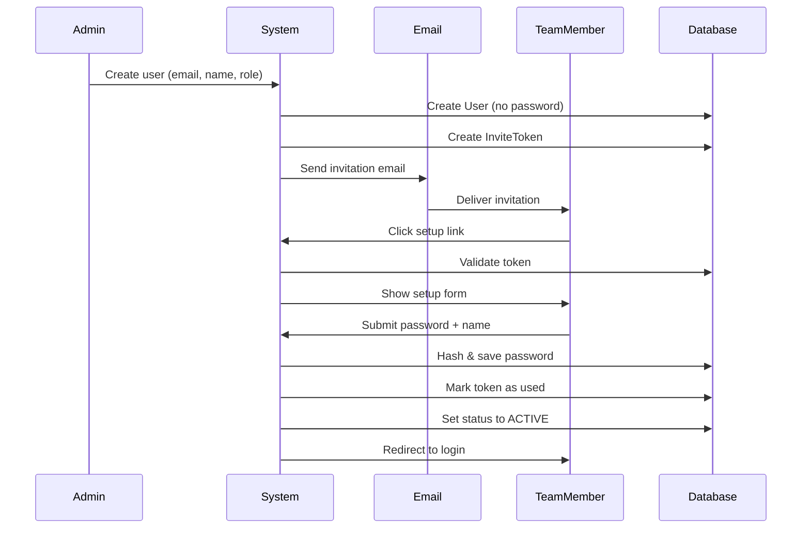
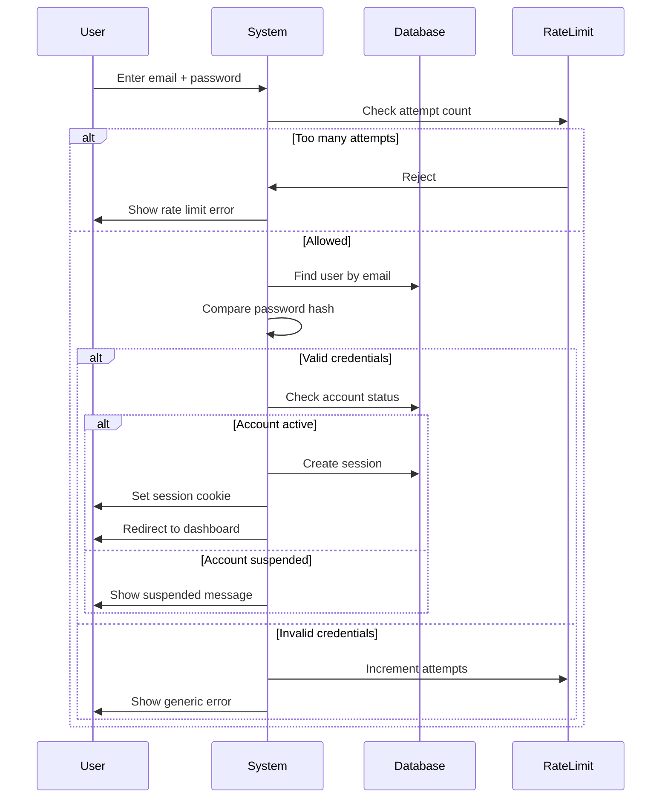
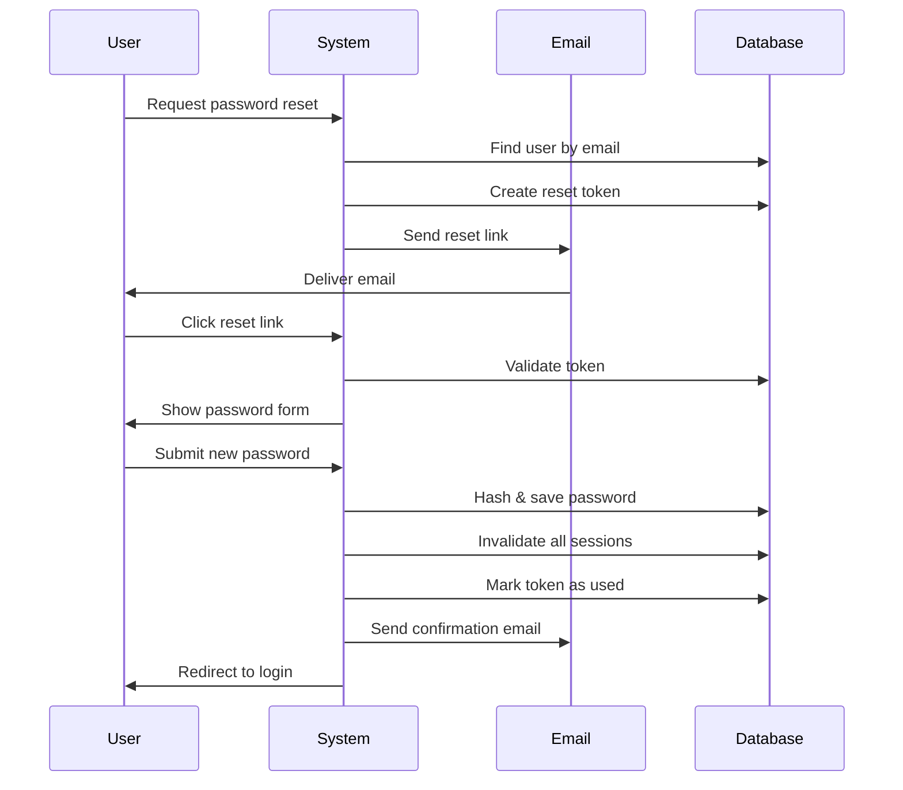
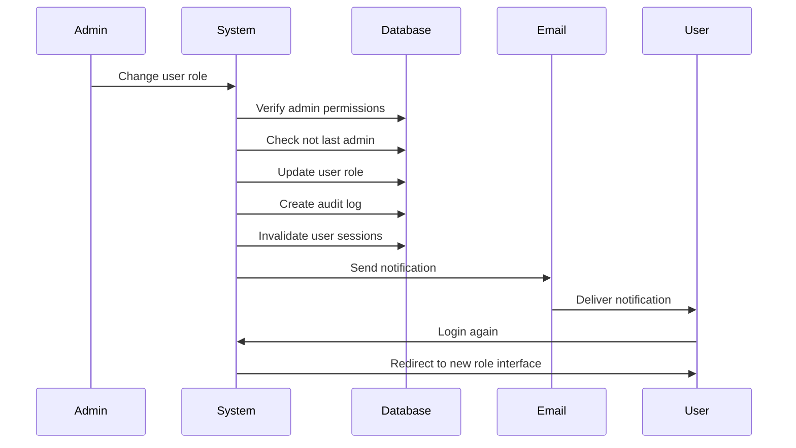

# Design Document

## Overview

The Account Management System extends the existing AFYA platform authentication to provide comprehensive user lifecycle management, role-based access control, and administrative capabilities. The system builds on the current NextAuth.js email-based authentication by adding password-based login, account invitation flows, profile management, and administrative controls. The architecture maintains the existing three-tier pattern while introducing new API endpoints, UI components, and database schema extensions to support team member management, account status tracking, and secure credential handling.

## Architecture

### High-Level Architecture

```
┌─────────────────────────────────────────────────────────────┐
│                     Client Browser                           │
│  ┌──────────────┐  ┌──────────────┐  ┌──────────────┐      │
│  │ Public Pages │  │ Auth Pages   │  │ Account Mgmt │      │
│  │              │  │ /login       │  │ /settings    │      │
│  │              │  │ /setup       │  │ /admin/users │      │
│  │              │  │ /reset-pwd   │  │              │      │
│  └──────────────┘  └──────────────┘  └──────────────┘      │
└─────────────────────────────────────────────────────────────┘
                            │
                            ▼
┌─────────────────────────────────────────────────────────────┐
│                   Next.js Application                        │
│  ┌──────────────────────────────────────────────────────┐   │
│  │              API Routes                              │   │
│  │  • POST /api/auth/credentials (login)               │   │
│  │  • POST /api/admin/users/create                     │   │
│  │  • POST /api/admin/users/[id]/role                  │   │
│  │  • POST /api/admin/users/[id]/status                │   │
│  │  • POST /api/auth/setup                             │   │
│  │  • POST /api/auth/reset-password                    │   │
│  │  • GET/PUT /api/me/profile                          │   │
│  └──────────────────────────────────────────────────────┘   │
│  ┌──────────────────────────────────────────────────────┐   │
│  │         NextAuth.js + Credentials Provider           │   │
│  └──────────────────────────────────────────────────────┘   │
└─────────────────────────────────────────────────────────────┘
                            │
                            ▼
┌─────────────────────────────────────────────────────────────┐
│                  Prisma ORM Layer                            │
└─────────────────────────────────────────────────────────────┘
                            │
                            ▼
┌─────────────────────────────────────────────────────────────┐
│                  PostgreSQL Database                         │
│  ┌──────────┐  ┌──────────┐  ┌──────────┐  ┌──────────┐   │
│  │  User    │  │  Client  │  │ InviteToken│ │AuditLog │   │
│  │ +password│  │          │  │            │  │         │   │
│  │ +status  │  │          │  │            │  │         │   │
│  └──────────┘  └──────────┘  └──────────┘  └──────────┘   │
└─────────────────────────────────────────────────────────────┘
```

### Authentication Strategy

The system will support **dual authentication modes**:

1. **Email Magic Link** (existing) - For clients during intake
2. **Email + Password** (new) - For all users, especially team members


### Technology Stack Additions

- **Password Hashing**: bcryptjs (already compatible with NextAuth)
- **Email Service**: Existing Nodemailer setup
- **Token Generation**: crypto.randomBytes for secure tokens
- **Rate Limiting**: upstash/ratelimit or simple in-memory for development

## Components and Interfaces

### Database Schema Extensions

```prisma
model User {
  id            String    @id @default(cuid())
  email         String    @unique
  emailVerified DateTime?
  name          String?
  password      String?   // NEW: Hashed password for credential login
  role          Role      @default(CLIENT)
  status        AccountStatus @default(ACTIVE) // NEW
  client        Client?
  accounts      Account[]
  sessions      Session[]
  inviteTokens  InviteToken[] // NEW
  auditLogs     AuditLog[]    // NEW
  createdAt     DateTime  @default(now())
  updatedAt     DateTime  @updatedAt

  @@index([email])
  @@index([status])
}

enum AccountStatus {
  ACTIVE
  SUSPENDED
  DEACTIVATED
}

model InviteToken {
  id        String   @id @default(cuid())
  userId    String
  user      User     @relation(fields: [userId], references: [id], onDelete: Cascade)
  token     String   @unique
  type      TokenType
  expiresAt DateTime
  usedAt    DateTime?
  createdAt DateTime @default(now())

  @@index([token])
  @@index([userId])
}

enum TokenType {
  ACCOUNT_SETUP
  PASSWORD_RESET
}

model AuditLog {
  id        String   @id @default(cuid())
  userId    String?
  user      User?    @relation(fields: [userId], references: [id], onDelete: SetNull)
  action    String   // e.g., "ROLE_CHANGED", "ACCOUNT_SUSPENDED", "LOGIN_FAILED"
  details   String?  // JSON string with additional context
  ipAddress String?
  createdAt DateTime @default(now())

  @@index([userId])
  @@index([action])
  @@index([createdAt])
}
```

### API Interfaces

#### POST /api/admin/users/create

**Authentication:** Required (ADMIN role)

**Request:**
```typescript
{
  email: string;
  name: string;
  role: "COACH" | "ADMIN";
}
```

**Response:**
```typescript
{
  success: boolean;
  user: {
    id: string;
    email: string;
    name: string;
    role: string;
  };
  inviteUrl: string;
}
```


#### POST /api/auth/setup

**Authentication:** None (uses token)

**Request:**
```typescript
{
  token: string;
  password: string;
  name?: string;
}
```

**Response:**
```typescript
{
  success: boolean;
  message: string;
}
```

#### POST /api/auth/credentials

**Authentication:** None

**Request:**
```typescript
{
  email: string;
  password: string;
}
```

**Response:**
```typescript
{
  success: boolean;
  user?: {
    id: string;
    email: string;
    role: string;
  };
  error?: string;
}
```

#### POST /api/auth/reset-password/request

**Authentication:** None

**Request:**
```typescript
{
  email: string;
}
```

**Response:**
```typescript
{
  success: boolean;
  message: string;
}
```

#### POST /api/auth/reset-password/confirm

**Authentication:** None (uses token)

**Request:**
```typescript
{
  token: string;
  password: string;
}
```

**Response:**
```typescript
{
  success: boolean;
  message: string;
}
```

#### GET /api/admin/users

**Authentication:** Required (ADMIN role)

**Query Parameters:**
- `search?: string` - Filter by name or email
- `role?: "CLIENT" | "COACH" | "ADMIN"` - Filter by role
- `status?: "ACTIVE" | "SUSPENDED" | "DEACTIVATED"` - Filter by status

**Response:**
```typescript
{
  users: Array<{
    id: string;
    email: string;
    name: string | null;
    role: string;
    status: string;
    createdAt: string;
    lastLoginAt: string | null;
  }>;
}
```


#### PUT /api/admin/users/[id]/role

**Authentication:** Required (ADMIN role)

**Request:**
```typescript
{
  role: "CLIENT" | "COACH" | "ADMIN";
}
```

**Response:**
```typescript
{
  success: boolean;
  user: {
    id: string;
    role: string;
  };
}
```

#### PUT /api/admin/users/[id]/status

**Authentication:** Required (ADMIN role)

**Request:**
```typescript
{
  status: "ACTIVE" | "SUSPENDED" | "DEACTIVATED";
}
```

**Response:**
```typescript
{
  success: boolean;
  user: {
    id: string;
    status: string;
  };
}
```

#### GET /api/me/profile

**Authentication:** Required

**Response:**
```typescript
{
  user: {
    id: string;
    email: string;
    name: string | null;
    role: string;
    status: string;
    createdAt: string;
  };
}
```

#### PUT /api/me/profile

**Authentication:** Required

**Request:**
```typescript
{
  name?: string;
  currentPassword?: string;
  newPassword?: string;
}
```

**Response:**
```typescript
{
  success: boolean;
  user: {
    id: string;
    name: string | null;
  };
}
```


## Key React Components

### UserManagementTable Component
- **Location**: `components/admin/UserManagementTable.tsx`
- **Purpose**: Display and manage all user accounts
- **Features**:
  - Search and filter functionality
  - Role badges with color coding
  - Status indicators
  - Action menu (edit role, suspend, reactivate)
  - Confirmation dialogs for destructive actions
- **State**: users list, filters, selected user, loading states

### CreateUserModal Component
- **Location**: `components/admin/CreateUserModal.tsx`
- **Purpose**: Form for creating new team member accounts
- **Props**: isOpen, onClose, onSuccess
- **Features**:
  - Email and name input
  - Role selection (COACH/ADMIN)
  - Email validation
  - Success message with invite link
- **State**: form data, validation errors, submission status

### AccountSetupForm Component
- **Location**: `components/auth/AccountSetupForm.tsx`
- **Purpose**: Allow new team members to set up their account
- **Features**:
  - Token validation
  - Password strength indicator
  - Name confirmation/update
  - Terms acceptance
- **State**: form data, token validity, password strength

### PasswordResetForm Component
- **Location**: `components/auth/PasswordResetForm.tsx`
- **Purpose**: Handle password reset flow
- **Features**:
  - Email input for request
  - New password input for confirmation
  - Token validation
  - Success/error messaging
- **State**: step (request/confirm), form data, token validity

### ProfileSettingsForm Component
- **Location**: `components/settings/ProfileSettingsForm.tsx`
- **Purpose**: Allow users to manage their profile
- **Features**:
  - Name update
  - Password change (requires current password)
  - Email display (read-only for now)
  - Role display (read-only)
- **State**: form data, validation errors, save status

### LoginForm Component (Enhanced)
- **Location**: `components/auth/LoginForm.tsx`
- **Purpose**: Unified login supporting both email magic link and credentials
- **Features**:
  - Email + password fields
  - "Forgot password" link
  - Toggle between magic link and password login
  - Remember me option
  - Rate limit error handling
- **State**: login method, form data, errors, loading


## Authentication Flows

### Team Member Invitation Flow



### Password-Based Login Flow



### Password Reset Flow




### Role Change Flow



## Data Models

### User Model Extensions

The existing User model will be extended with:
- **password**: Nullable string for hashed password (bcrypt)
- **status**: Enum (ACTIVE, SUSPENDED, DEACTIVATED)
- **lastLoginAt**: DateTime tracking last successful login
- Relations to InviteToken and AuditLog

### InviteToken Model

Stores temporary tokens for account setup and password reset:
- **token**: Unique hashed string
- **type**: ACCOUNT_SETUP or PASSWORD_RESET
- **expiresAt**: Expiration timestamp (72h for setup, 1h for reset)
- **usedAt**: Timestamp when token was consumed
- Linked to User via userId

### AuditLog Model

Tracks security-relevant actions:
- **action**: String describing the action (e.g., "ROLE_CHANGED", "LOGIN_FAILED")
- **details**: JSON string with context (old/new values, reason)
- **ipAddress**: Request IP for security tracking
- **userId**: Optional link to user who performed action
- Indexed by action and createdAt for efficient querying


## Security Considerations

### Password Security

1. **Hashing**: Use bcryptjs with cost factor 12 (stronger than minimum requirement)
2. **Strength Requirements**:
   - Minimum 8 characters
   - At least one uppercase letter
   - At least one lowercase letter
   - At least one number
   - Optional: Special character for enhanced security
3. **Storage**: Never log or display passwords, only hashed values in database

### Token Security

1. **Generation**: Use crypto.randomBytes(32) for cryptographically secure tokens
2. **Storage**: Store hashed tokens in database (using SHA-256)
3. **Expiration**: 
   - Account setup: 72 hours
   - Password reset: 1 hour
4. **Single Use**: Mark tokens as used after consumption
5. **Validation**: Check expiration and used status before accepting

### Rate Limiting

1. **Login Attempts**: Maximum 5 failed attempts per email per 15 minutes
2. **Password Reset**: Maximum 3 requests per email per hour
3. **Account Creation**: Maximum 10 new accounts per admin per hour
4. **Implementation**: Use in-memory store for development, Redis for production

### Session Security

1. **Cookie Flags**: httpOnly, secure (HTTPS only), sameSite: lax
2. **Expiration**: 7 days of inactivity
3. **Invalidation**: Clear sessions on password change, role change, or account suspension
4. **CSRF Protection**: NextAuth built-in CSRF tokens

### Authorization Checks

1. **API Routes**: Verify authentication and role on every request
2. **Admin Actions**: Double-check ADMIN role before destructive operations
3. **Self-Protection**: Prevent users from suspending/deleting their own account
4. **Last Admin**: Prevent role change or deletion of last ADMIN user

### Audit Logging

Log the following actions:
- Login attempts (success and failure)
- Password changes
- Role changes
- Account status changes
- Account creation
- Failed authorization attempts

Store: userId, action, timestamp, IP address, details (JSON)


## Error Handling

### Client-Side Error Handling

1. **Form Validation Errors**
   - Display inline errors for invalid inputs
   - Show password strength indicator in real-time
   - Highlight required fields
   - Prevent submission until valid

2. **Authentication Errors**
   - Generic message for invalid credentials (don't reveal which field is wrong)
   - Clear message for suspended accounts
   - Helpful message for expired tokens with contact info
   - Rate limit message with retry time

3. **Network Errors**
   - Toast notifications for API failures
   - Retry buttons for transient errors
   - Offline detection and messaging

### Server-Side Error Handling

1. **Validation Errors**
   - Return 400 with specific field errors
   - Validate email format, password strength
   - Check for duplicate emails

2. **Authentication Errors**
   - Return 401 for invalid credentials
   - Return 403 for insufficient permissions
   - Return 429 for rate limit exceeded

3. **Business Logic Errors**
   - Return 409 for conflicts (e.g., can't delete last admin)
   - Return 404 for user not found
   - Return 410 for expired tokens

4. **Database Errors**
   - Catch Prisma errors and return generic 500
   - Log full error details server-side
   - Handle unique constraint violations gracefully

### Error Logging

- Log all authentication failures with IP address
- Log all authorization failures
- Log all rate limit violations
- Log all token validation failures
- Use structured logging for easy querying


## Testing Strategy

### Unit Testing

1. **Password Hashing Utilities**
   - Test bcrypt hashing and comparison
   - Verify cost factor is correct
   - Test password strength validation

2. **Token Generation**
   - Test token uniqueness
   - Test token hashing
   - Test expiration calculation

3. **Validation Functions**
   - Test email validation
   - Test password strength rules
   - Test role validation

### Integration Testing

1. **Account Creation Flow**
   - Admin creates user → invitation sent → user sets up account
   - Verify database records created correctly
   - Verify email sent with correct token

2. **Authentication Flow**
   - Test successful login with valid credentials
   - Test failed login with invalid credentials
   - Test rate limiting after multiple failures
   - Test suspended account login rejection

3. **Password Reset Flow**
   - Request reset → receive email → set new password
   - Verify old sessions invalidated
   - Verify token single-use enforcement

4. **Role Management**
   - Change user role → verify access changes
   - Verify last admin protection
   - Verify audit log created

### API Testing

Test all endpoints with:
- Valid requests
- Invalid authentication
- Invalid authorization (wrong role)
- Invalid input data
- Edge cases (expired tokens, suspended accounts)

### Security Testing

1. **Rate Limiting**: Verify limits enforced correctly
2. **Token Security**: Verify tokens can't be reused or guessed
3. **Session Security**: Verify cookies have correct flags
4. **Authorization**: Verify role checks work correctly
5. **CSRF Protection**: Verify CSRF tokens required

### Manual Testing Checklist

- [ ] Admin can create team member accounts
- [ ] Team member receives invitation email
- [ ] Team member can set up account with invitation link
- [ ] Users can log in with email and password
- [ ] Users can reset forgotten password
- [ ] Users can update their profile
- [ ] Admin can change user roles
- [ ] Admin can suspend/reactivate accounts
- [ ] Suspended users cannot log in
- [ ] Rate limiting prevents brute force
- [ ] Audit logs track all security events
- [ ] Last admin cannot be deleted or demoted


## UI/UX Design Considerations

### User Management Interface

**Layout:**
- Search bar at top
- Filter chips for role and status
- Table with columns: Name, Email, Role, Status, Created, Actions
- Action menu (three dots) for each user
- "Create User" button in top-right

**Visual Design:**
- Role badges: CLIENT (gray), COACH (blue), ADMIN (purple)
- Status indicators: ACTIVE (green dot), SUSPENDED (yellow dot), DEACTIVATED (red dot)
- Hover states on table rows
- Confirmation modals for destructive actions

### Account Setup Page

**Layout:**
- Centered card with AFYA branding
- Welcome message with team member's name
- Password input with strength indicator
- Name confirmation field
- Submit button

**Visual Design:**
- Password strength bar (red → yellow → green)
- Clear validation messages
- Success animation on completion

### Login Page Enhancement

**Layout:**
- Email and password fields
- "Forgot password?" link below password
- "Sign in" button
- Optional: "Or sign in with magic link" toggle

**Visual Design:**
- Consistent with existing AFYA theme (turquoise/lavender)
- Clear error messages
- Loading state on button

### Profile Settings Page

**Layout:**
- Sidebar navigation (Profile, Security, Preferences)
- Main content area with sections:
  - Personal Information (name, email)
  - Security (change password)
  - Account Details (role, status - read-only)

**Visual Design:**
- Section dividers
- Save button at bottom of each section
- Success toast on save
- Inline validation

### Password Reset Pages

**Request Page:**
- Email input
- Submit button
- Back to login link

**Confirm Page:**
- New password input with strength indicator
- Confirm password input
- Submit button

**Visual Design:**
- Clear instructions
- Success message with auto-redirect
- Error handling for expired tokens


## Email Templates

### Team Member Invitation Email

**Subject:** You've been invited to join AFYA

**Body:**
```
Hi [Name],

You've been invited to join the AFYA team as a [Role].

To set up your account, click the link below:
[Setup Link]

This link will expire in 72 hours.

If you have any questions, please contact your administrator.

Welcome to AFYA!
```

### Password Reset Email

**Subject:** Reset your AFYA password

**Body:**
```
Hi [Name],

We received a request to reset your password for your AFYA account.

Click the link below to reset your password:
[Reset Link]

This link will expire in 1 hour.

If you didn't request this, you can safely ignore this email.

- AFYA Team
```

### Password Changed Confirmation Email

**Subject:** Your AFYA password was changed

**Body:**
```
Hi [Name],

Your password for your AFYA account was successfully changed.

If you didn't make this change, please contact your administrator immediately.

- AFYA Team
```

### Role Changed Notification Email

**Subject:** Your AFYA account role has been updated

**Body:**
```
Hi [Name],

Your role in the AFYA system has been changed to [New Role].

You may need to log in again to access your new permissions.

If you have questions about this change, please contact your administrator.

- AFYA Team
```

### Account Suspended Email

**Subject:** Your AFYA account has been suspended

**Body:**
```
Hi [Name],

Your AFYA account has been suspended.

If you believe this is an error, please contact your administrator.

- AFYA Team
```


## Implementation Considerations

### NextAuth Configuration Changes

The existing NextAuth setup uses email magic links. We'll extend it to support credentials:

```typescript
// lib/auth.ts
import Credentials from "next-auth/providers/credentials";
import bcrypt from "bcryptjs";

providers: [
  Nodemailer({...}), // Keep existing
  Credentials({
    name: "credentials",
    credentials: {
      email: { label: "Email", type: "email" },
      password: { label: "Password", type: "password" }
    },
    async authorize(credentials) {
      if (!credentials?.email || !credentials?.password) {
        return null;
      }

      const user = await prisma.user.findUnique({
        where: { email: credentials.email }
      });

      if (!user || !user.password) {
        return null;
      }

      if (user.status !== "ACTIVE") {
        throw new Error("Account suspended");
      }

      const isValid = await bcrypt.compare(
        credentials.password,
        user.password
      );

      if (!isValid) {
        // Log failed attempt
        await logAuditEvent("LOGIN_FAILED", user.id);
        return null;
      }

      // Log successful login
      await logAuditEvent("LOGIN_SUCCESS", user.id);
      
      return {
        id: user.id,
        email: user.email,
        name: user.name,
        role: user.role
      };
    }
  })
]
```

### Migration Strategy

1. **Database Migration**: Add new fields to User table, create InviteToken and AuditLog tables
2. **Backward Compatibility**: Existing users without passwords can still use magic links
3. **Gradual Rollout**: 
   - Phase 1: Add password support, keep magic links
   - Phase 2: Create admin accounts with passwords
   - Phase 3: Migrate existing users to passwords (optional)

### Environment Variables

Add to `.env.local`:
```bash
# Rate Limiting (optional, for production)
UPSTASH_REDIS_REST_URL=""
UPSTASH_REDIS_REST_TOKEN=""

# Email templates base URL
NEXT_PUBLIC_APP_URL="http://localhost:3000"
```


## Performance Considerations

1. **Database Queries**
   - Index email, status, and token fields
   - Use Prisma select to fetch only needed fields
   - Implement pagination for user list (future enhancement)

2. **Password Hashing**
   - Bcrypt is intentionally slow (security feature)
   - Use cost factor 12 (good balance)
   - Consider async hashing to avoid blocking

3. **Rate Limiting**
   - Use in-memory Map for development
   - Use Redis for production (scales across instances)
   - Clean up expired entries periodically

4. **Session Management**
   - NextAuth handles session storage efficiently
   - Database sessions allow cross-device invalidation
   - Consider Redis session store for high traffic (future)

5. **Audit Logging**
   - Write audit logs asynchronously
   - Index by userId and createdAt for fast queries
   - Implement log rotation/archival (future)

## Deployment Considerations

### Database Migration

Run Prisma migration before deploying:
```bash
npx prisma migrate deploy
```

### Environment Variables

Ensure all required variables are set in production:
- NEXTAUTH_SECRET (generate new secure value)
- NEXTAUTH_URL (production domain)
- EMAIL_SERVER_* (email service credentials)
- WEBHOOK_SECRET (existing)
- DATABASE_URL (existing)

### Initial Admin Account

Create first admin account manually via Prisma Studio or SQL:
```sql
INSERT INTO "User" (id, email, name, role, status, password, "createdAt", "updatedAt")
VALUES (
  'admin-001',
  'admin@afya.com',
  'Admin User',
  'ADMIN',
  'ACTIVE',
  '$2a$12$[bcrypt_hash_here]', -- Hash of initial password
  NOW(),
  NOW()
);
```

Or create a seed script for initial setup.

### Monitoring

Monitor the following:
- Failed login attempts (potential attacks)
- Rate limit violations
- Token expiration rates
- Account creation patterns
- Role change frequency

### Backup Strategy

- Regular database backups (Vercel Postgres handles this)
- Audit log retention policy (keep for 90 days minimum)
- User data export capability (GDPR compliance)

